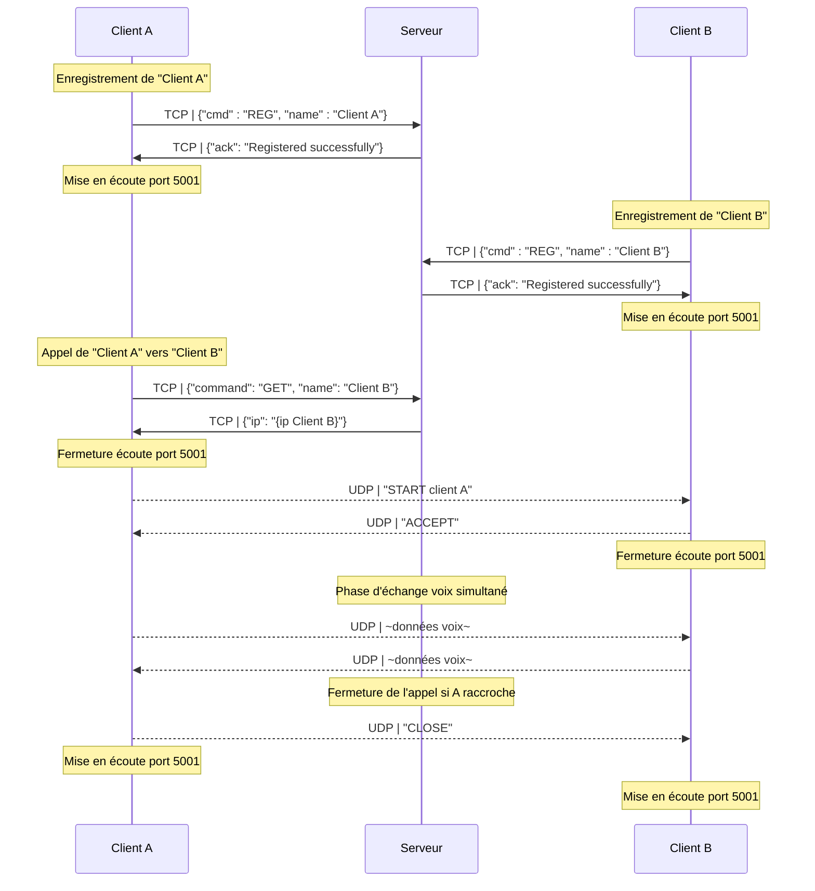
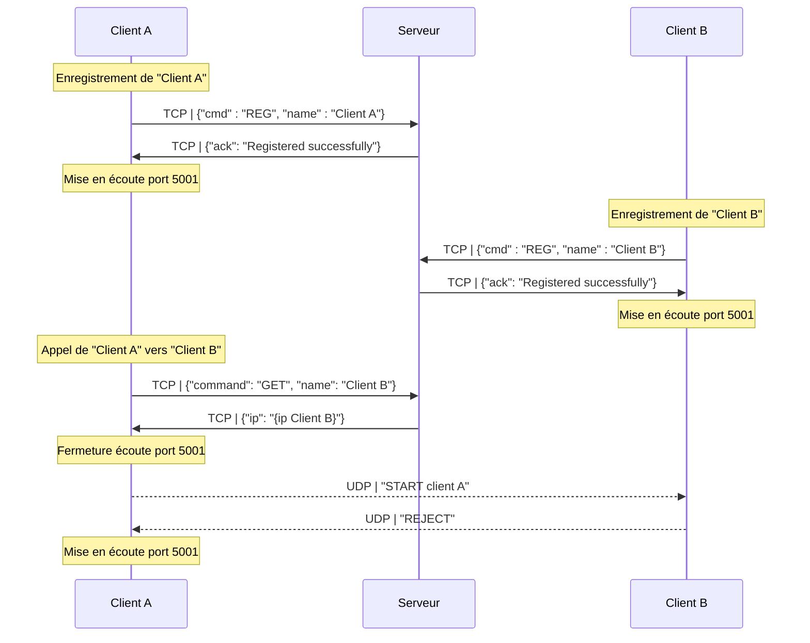
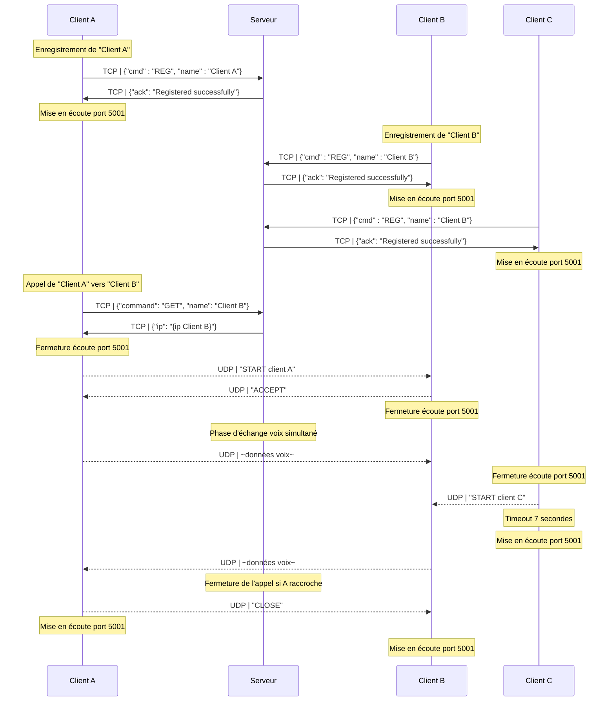

<!-- markdownlint-disable MD036 MD033 MD024 -->
<!-- omit in toc -->
# Compte Rendu - SAE POO 2023

**Titre - Compte Rendu Projet DevCloud**

**Auteurs:**
    **- Noilou Quentin**
    **- Person Mathys**
    **- Rocabois Damien**

**Créé le - 28 Janvier 2023**

---

- [Fonctionnalités](#fonctionnalités)
  - [Serveur](#serveur)
    - [Fonctionnalités de la base de données](#fonctionnalités-de-la-base-de-données)
    - [Fonctionnalités du serveur](#fonctionnalités-du-serveur)
    - [Fonctionnalités de l'interface utilisateur](#fonctionnalités-de-linterface-utilisateur)
  - [Client](#client)
    - [Connexion au serveur](#connexion-au-serveur)
    - [Appel en direct](#appel-en-direct)
    - [Interface utilisateur](#interface-utilisateur)
    - [Utilisation de thread](#utilisation-de-thread)
- [Diagrammes des flux](#diagrammes-des-flux)
  - [Appel Normal](#appel-normal)
  - [Appel refusé](#appel-refusé)
  - [Double Appel](#double-appel)

 

## Fonctionnalités

### Serveur

- Lancement d'une écoute sur le port 10000 et l'adresse qui permet de contacter le WAN (à défaut d'accès WAN, il faut hardcoder l'adresse)

#### Fonctionnalités de la base de données

- Enregistrement d'utilisateurs avec un nom d'utilisateur et une adresse IP
- Récupération de l'adresse IP d'un utilisateur en utilisant son nom d'utilisateur
- Suppression d'utilisateurs en utilisant leur nom d'utilisateur

#### Fonctionnalités du serveur

- Écoute de nouvelles connexions de clients
- Traitement des commandes reçues des clients (REG, GET, DISCONNECT)
- Envoi de réponses aux clients en fonction des commandes reçues
- Gestion des erreurs et des déconnexions de clients :
  - Si le client se déconnecte ou ferme la connexion TCP, suppression du client dans la BDD

#### Fonctionnalités de l'interface utilisateur

- Affichage du socket d'écoute
- Affichage des informations de journalisation pour suivre les activités du serveur
- Bouton pour fermer le serveur et quitter l'application.

### Client

- Pas de connaissance de sa propre IP, c'est le serveur qui enregistre l'IP avec laquelle il a été contacté (pas de support du NAT)

#### Connexion au serveur

- Le client peut se connecter à un serveur en saisissant l'adresse IP et le port dans la fenêtre de connexion.
- Le client peut envoyer son nom d'utilisateur au serveur lors de la connexion.
- Le client peut recevoir la liste des utilisateurs en ligne du serveur et l'afficher dans sa fenêtre.
- Le client peut se déconnecter du serveur en utilisant le bouton de déconnexion ou en fermant la fenêtre.

#### Appel en direct

- Le client peut envoyer une demande d'appel à un autre utilisateur en ligne en sélectionnant son nom dans la liste des utilisateurs et en appuyant sur le bouton "Appeler".
- Le client peut recevoir une demande d'appel d'un autre utilisateur dans une fenêtre contextuelle, avec les options pour accepter ou rejeter l'appel.
- Le client peut accepter ou rejeter un appel en utilisant les boutons appropriés dans la fenêtre contextuelle d'appel entrant.
- Le client peut transmettre et recevoir de l'audio en direct avec un autre utilisateur lorsqu'un appel est accepté.
- Le client peut raccrocher à un appel en cours en utilisant le bouton "Raccrocher" ou en fermant la fenêtre.

#### Interface utilisateur

- Le client a une interface graphique avec une fenêtre de connexion, une fenêtre principale et une fenêtre contextuelle pour les appels entrants.
- Le client affiche des messages dans une zone de texte pour indiquer les actions en cours, comme la connexion au serveur, les demandes d'appel et les appels en cours.
- Le client utilise des boutons pour les actions telles que la connexion, l'appel, l'acceptation et le rejet des appels, et le raccrochage.

#### Utilisation de thread

- Le client utilise des threads pour écouter les demandes d'appel entrantes en arrière-plan, pour transmettre et recevoir de l'audio en direct lors d'un appel, et pour se déconnecter du serveur en arrière-plan

## Diagrammes des flux

Le serveur est en écoute sur le port 10000 par défaut.

### Appel Normal

### Appel refusé

### Double Appel

