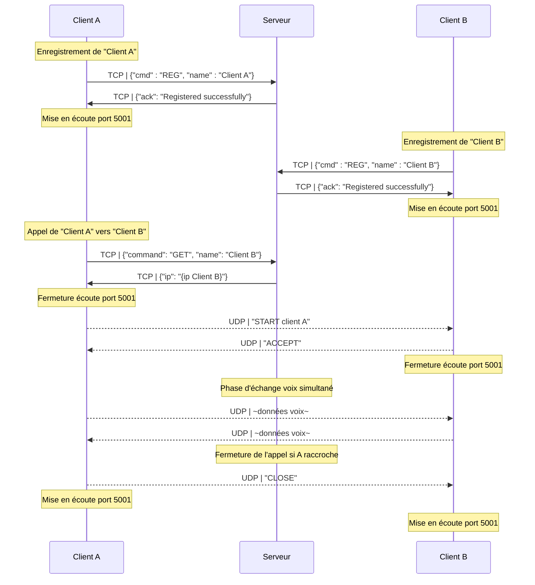
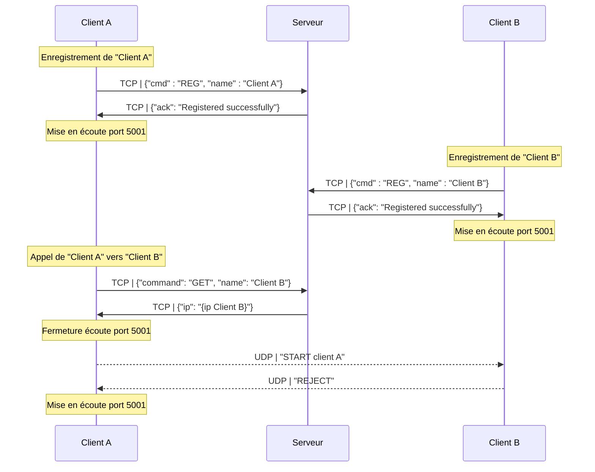
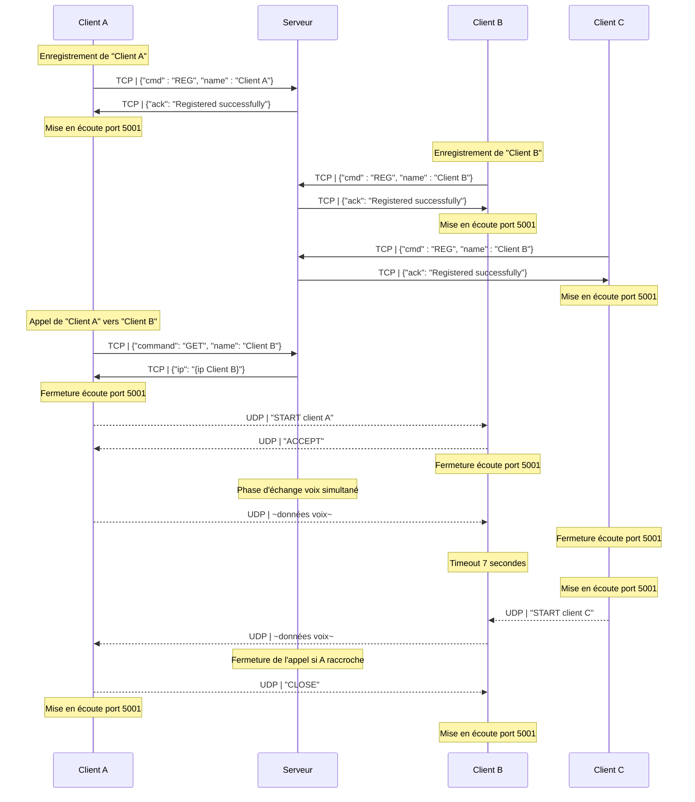

<!-- markdownlint-disable MD036 MD033 MD024 -->
<!-- omit in toc -->
# Compte Rendu - SAE POO 2023

**Titre - Compte Rendu Projet DevCloud**

**Auteurs:**
    **- Noilou Quentin**
    **- Person Mathys**
    **- Rocabois Damien**

**Créé le - 11 novembre 2022**

---

- [Fonctionnalités](#fonctionnalités)
  - [Démarrage Serveur](#démarrage-serveur)
    - [Fonctionnalités de la base de données](#fonctionnalités-de-la-base-de-données)
    - [Fonctionnalités du serveur](#fonctionnalités-du-serveur)
    - [Fonctionnalités de l'interface utilisateur](#fonctionnalités-de-linterface-utilisateur)
  - [Configuration Client](#configuration-client)
- [Diagrammes des flux](#diagrammes-des-flux)
  - [Appel Normal](#appel-normal)
  - [Appel refusé](#appel-refusé)
  - [Double Appel](#double-appel)

 

## Fonctionnalités

### Démarrage Serveur

#### Fonctionnalités de la base de données

- Enregistrement d'utilisateurs avec un nom d'utilisateur et une adresse IP
- Récupération de l'adresse IP d'un utilisateur en utilisant son nom d'utilisateur
- Suppression d'utilisateurs en utilisant leur nom d'utilisateur

#### Fonctionnalités du serveur

- Écoute de nouvelles connexions de clients
- Traitement des commandes reçues des clients (REG, GET, DISCONNECT)
- Envoi de réponses aux clients en fonction des commandes reçues
- Gestion des erreurs et des déconnexions de clients

#### Fonctionnalités de l'interface utilisateur

- Affichage des informations de journalisation pour suivre les activités du serveur
- Bouton pour fermer le serveur et quitter l'application.

Threads

Son adresse est récupérée en envoyant un paquet à 8.8.8.8 et en utilisant l'IP depuis laquelle il envoie le paquet. Cette méthode permet d'utiliser une adresse IP qui a un accès à internet.
Il est également possible de la "hardcoder" si on se trouve dans un réseau sans accès internet.

### Configuration Client

- Pas de connaissance de sa propre IP, c'est le serveur qui enregistre l'IP avec laquelle il a été contacté (pas de support du NAT)

## Diagrammes des flux

Le serveur est en écoute sur le port 10000 par défaut.

### Appel Normal

### Appel refusé

### Double Appel

