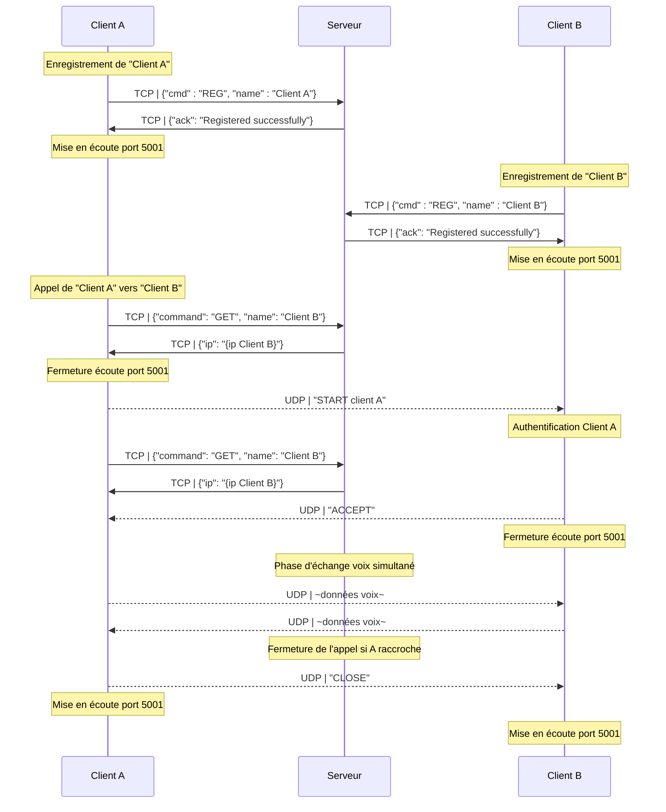
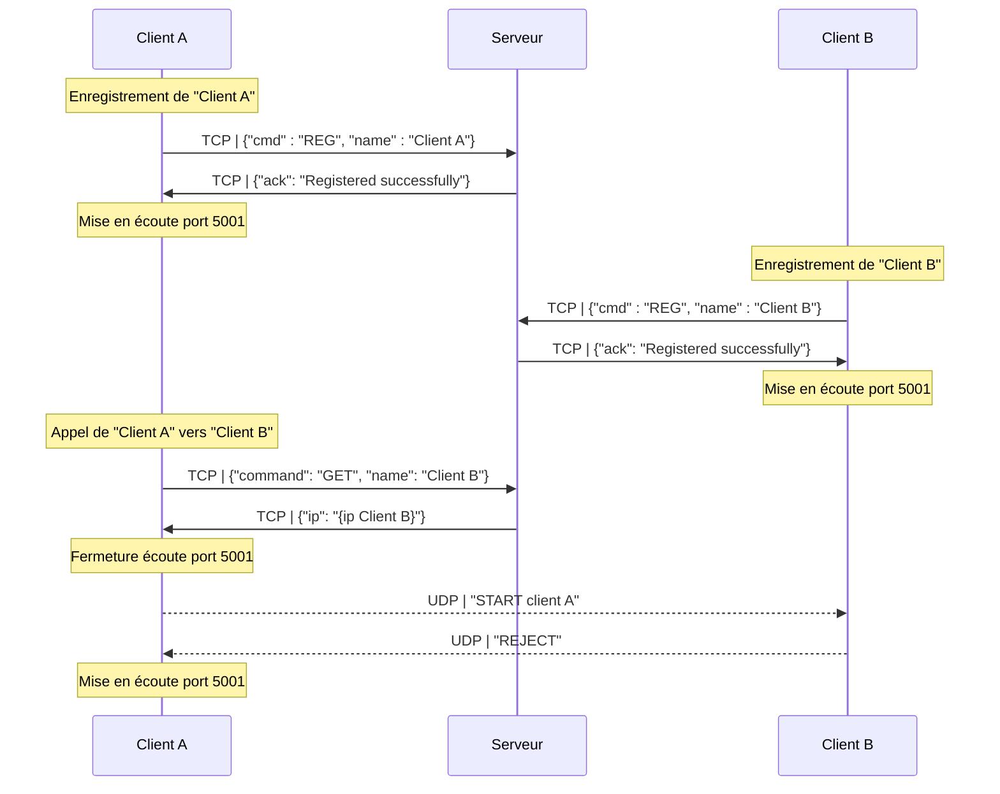
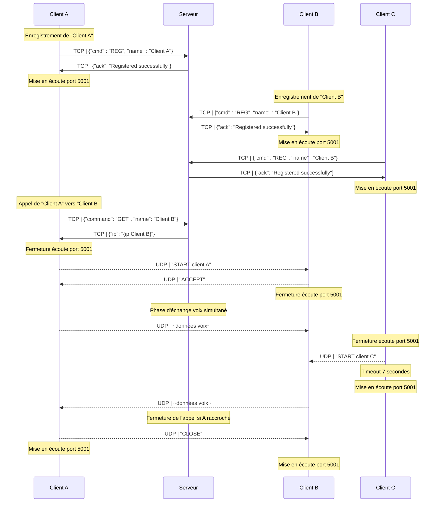
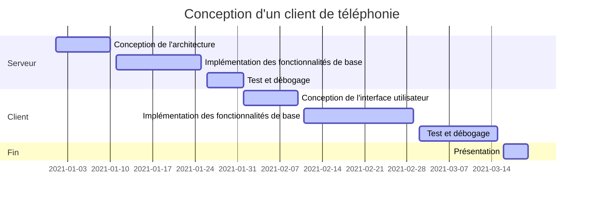

<!-- markdownlint-disable MD036 MD033 MD024 -->
<!-- omit in toc -->
# Compte Rendu - SAE POO 2023

**Titre - Compte Rendu Projet DevCloud**

**Auteurs:**
    **- Noilou Quentin**
    **- Person Mathys**
    **- Rocabois Damien**

**Créé le - 28 Janvier 2023**

---

- [Protocoles](#protocoles)
  - [Protocole Communication serveur](#protocole-communication-serveur)
  - [Protocole Communication client](#protocole-communication-client)
- [Diagrammes des flux](#diagrammes-des-flux)
  - [Appel Normal](#appel-normal)
  - [Appel refusé](#appel-refusé)
  - [Double Appel](#double-appel)
- [Gestion des erreurs](#gestion-des-erreurs)
  - [Client](#client)
- [Gestion de projet](#gestion-de-projet)
  - [Gantt](#gantt)
  - [Répartition des tâches](#répartition-des-tâches)
  - [Communication](#communication)
  - [Gestion des risques](#gestion-des-risques)
  - [Retex](#retex)
    - [Quentin](#quentin)
    - [Mathys](#mathys)
    - [Damien](#damien)
    - [Groupe](#groupe)
- [Fonctionnalités](#fonctionnalités)
  - [Serveur](#serveur)
  - [Client](#client-1)
    - [Documentation fonctionnelle](#documentation-fonctionnelle)
- [Evolutions possibles](#evolutions-possibles)
- [TODO](#todo)

 

## Protocoles

Voici le protocole que nous avons mis en place :

### Protocole Communication serveur

Via le protocole TCP :

`{"command": "GET", "name": nom_destinataire}` : Récupère l'adresse IP associée au nom demandé, si le client n'existe pas, retourne "None".

Réponses possibles :

- `{"ip": "None"}`
- `{"ip": 127.0.0.1}`

`{"command": "REG", "name": nom_client}` : Envoie une demande d'enregistrement au serveur avec notre nom. Le serveur récupère automatiquement notre ip depuis le paquet qu'il reçoit (en-tête IP).

Réponses possibles :

- `{"ack": "Registered successfully"}` : l'enregistrement s'est bien déroulé dans la BDD
- `{"ack": "Error Registering"}` : la BDD n'a pas pu enregistrer notre nom
- `{"ack": "Error"}` : le serveur a buggé pour nous enregistrer

`{"command": "DISCONNECT", "name": nom_client}` : permet la déconnexion propre du client connecté au serveur (fermeture thread et socket de connexion, suppression de l'entrée dans la BDD)

### Protocole Communication client

Lorsqu'on envoie une demande d'appel, le socket d'écoute se ferme.
De même, lorsqu'on reçoit une demande d'appel, on ferme notre socket d'écoute le temps de répondre

`"START nom_appellant"` : Envoie une demande d'appel à l'appelé après avoir récupéré son IP à partir du serveur, ferme l'écoute sur le socket

`"ACCEPT"` : Accepte une demande d'appel reçu, ouvre l'échange d'audio (fonction transmit_audio())

`"REJECT"`: Rejette une demande d'appel reçu, rouvre l'écoute sur le socket

`"CLOSE"` : Permet de raccrocher (fermeture socket et pyaudio en écoute et écriture), rouvre l'écoute sur le socket

## Diagrammes des flux

Le serveur est en écoute sur le port 10000 par défaut.

 

### Appel Normal

 

### Appel refusé

 

### Double Appel

## Gestion des erreurs

Codes de sortie :

- 0 : Code complété correctement
- 1 : Avertissement (non critique)
- 2 : Erreur critique
- 3 : Erreur inconnue

XXX METTRE LES SCREENS

### Client

<!-- omit from toc -->
#### Si un client est déjà lancé sur un ordinateur et qu'un socket est déjà bind

Alors la fenêtre principale se ferme en annoncant l'erreur dans la sortie standard (Terminal).
Exit code : 2 (CRITICAL)

## Gestion de projet

### Gantt

### Répartition des tâches

Nous avons décidé de diviser le projet en 2 parties:

- Le "Front-end", qui correspond aux interfaces graphiques
- Le "Back-end", qui correspond aux gestions de la base de données, des flux réseaux, des threads etc...

De fait, chacun s'est retrouvé avec des missions claires :

- Mathys :

  - Design de l'IHM du serveur
  - Création de l'IHM du serveur
  - Accords avec Quentin concernant les fonctionnalités attendues de l'interface du serveur (logs, bouton de fermeture, affichage du socket d'écoute)
  - Interfaçage avec le back-end (relier les boutons aux fonctions)

- Damien :
  - Design de l'IHM du client
  - Création de l'IHM du client
  - Accords avec Quentin concernant les fonctionnalités attendues de l'interface du client (logs, bouton de configuration, connexion, appel, raccrochage, pop-up lorsqu'on reçoit un appel)
  - Interfaçage avec le back-end (relier les boutons aux fonctions)

- Quentin

  - Design du fonctionnement de l'application
    - Flux résaux (ports d'écoute et d'envoi)

  - Etablissement du protocole téléphonique (Cf. [Ici](#protocoles))
  - Gestion des threads
  - Gestion de la BDD
  - Gestion des sockets

### Communication

Pour ce projet, nous avons utilisé Discord avec des channels spécifiques(Front, Back, IHM-Back Serveur, IHM-Back Client).

Ainsi nous pouvions retrouver nos conversations facilement lorsqu'elles concernaient des points spécifiques.

Nous avions également un channel général pour planifier les séances d'autonomie et nos réunions.

### Gestion des risques

Pour éviter de perdre notre avancée, nous avons utilisé github pour héberger nos codes sources, gérer le versioning et collaborer plus facilement.

### Retex

#### Quentin

#### Mathys

#### Damien

#### Groupe

|Ce qu'on a bien réussi|Ce qu'on aurait pu améliorer|
|-|-|
|Les IHM sont modernes efficaces (logs, boutons simples)||
|Le protocole d'échange|La sécurité des échanges : on aurait pu inclure une fonction de chiffrement de la voix et un échange de clé secrète pour mieux gérer la confidentialité de l'appel|
Ce qu'on a bien réussi: Les interfaces sont designs, d'un côté le serveur met à jour la bed toute les secondes et on a les informations de connexion, ce qui est un avantage.
Ce qu'on aurait pu améliorer : On aurait pu gérer les différents cas de figure tel qu'un appel intervenant dans l'appel déjà existant entre deux clients par exemple. On aurait aussi pu gérer la sécurité car n'importe qui sur le réseau peut récupérer le flux TCP mais nous avons décidé d'aller au plus simple

## Fonctionnalités

### Serveur

- Lancement d'une écoute sur le port 10000 et l'adresse qui permet de contacter le WAN (à défaut d'accès WAN, il faut hardcoder l'adresse)

<!-- omit from toc -->
#### Fonctionnalités de la base de données

- Enregistrement d'utilisateurs avec un nom d'utilisateur et une adresse IP
- Récupération de l'adresse IP d'un utilisateur en utilisant son nom d'utilisateur
- Suppression d'utilisateurs en utilisant leur nom d'utilisateur

<!-- omit from toc -->
#### Fonctionnalités du serveur

- Écoute de nouvelles connexions de clients
- Traitement des commandes reçues des clients (REG, GET, DISCONNECT)
- Envoi de réponses aux clients en fonction des commandes reçues
- Gestion des erreurs et des déconnexions de clients :
  - Si le client se déconnecte ou ferme la connexion TCP, suppression du client dans la BDD

<!-- omit from toc -->
#### Fonctionnalités de l'interface utilisateur

- Affichage du socket d'écoute
- Affichage des informations de journalisation pour suivre les activités du serveur
- Bouton pour fermer le serveur et quitter l'application.

### Client

- Pas de connaissance de sa propre IP, c'est le serveur qui enregistre l'IP avec laquelle il a été contacté (pas de support du NAT)

<!-- omit from toc -->
#### Connexion au serveur

- Le client peut se connecter à un serveur en saisissant l'adresse IP et le port dans la fenêtre de connexion.
- Le client peut envoyer son nom d'utilisateur au serveur lors de la connexion.
- Le client peut recevoir la liste des utilisateurs en ligne du serveur et l'afficher dans sa fenêtre.
- Le client peut se déconnecter du serveur en utilisant le bouton de déconnexion ou en fermant la fenêtre.

<!-- omit from toc -->
#### Appel en direct

- Le client peut envoyer une demande d'appel à un autre utilisateur en ligne en sélectionnant son nom dans la liste des utilisateurs et en appuyant sur le bouton "Appeler".
- Le client peut recevoir une demande d'appel d'un autre utilisateur dans une fenêtre contextuelle, avec les options pour accepter ou rejeter l'appel.
- Le client peut accepter ou rejeter un appel en utilisant les boutons appropriés dans la fenêtre contextuelle d'appel entrant.
- Le client peut transmettre et recevoir de l'audio en direct avec un autre utilisateur lorsqu'un appel est accepté.
- Le client peut raccrocher à un appel en cours en utilisant le bouton "Raccrocher" ou en fermant la fenêtre.

<!-- omit from toc -->
#### Interface utilisateur

- Le client a une interface graphique avec une fenêtre de connexion, une fenêtre principale et une fenêtre contextuelle pour les appels entrants.
- Le client affiche des messages dans une zone de texte pour indiquer les actions en cours, comme la connexion au serveur, les demandes d'appel et les appels en cours.
- Le client utilise des boutons pour les actions telles que la connexion, l'appel, l'acceptation et le rejet des appels, et le raccrochage.

<!-- omit from toc -->
#### Utilisation de thread

- Le client utilise des threads pour écouter les demandes d'appel entrantes en arrière-plan, pour transmettre et recevoir de l'audio en direct lors d'un appel, et pour se déconnecter du serveur en arrière-plan

#### Documentation fonctionnelle

<!-- omit from toc -->
##### initialisation

Cette partie initialise l'interface graphique (GUI) et les sockets pour la connexion au serveur et la transmission audio.
Il définit des variables pour enregistrer des informations telles que l'IP du serveur, le port du serveur, le nom du client, l'état de la connexion, etc.
Ensuite, il crée deux sockets, un pour la connexion TCP avec le serveur et l'autre pour la transmission de l'audio UDP. Le socket UDP est lié à un port (5001).
Il initialise également des objets PyAudio pour l'enregistrement et la lecture audio et définit le format audio (paInt16), le nombre de canaux (1), la fréquence d'échantillonnage (8000 Hertz) et le nombre d'échantillons (512).
Enfin, il crée des éléments de l'interface graphique tels que des zones de saisie pour l'IP du serveur, le port du serveur et le nom du client, des boutons pour la configuration et l'appel, etc.

<!-- omit from toc -->
##### configure

La fonction est appelée pour configurer la connexion avec le serveur de communication à l'aide des informations saisies dans la GUI.
La fonction effectue les étapes suivantes :

 1. Récupère l'adresse IP du serveur, le numéro de port et le nom du client depuis les entrées de la GUI.

 2. Vérifie si l'adresse IP du serveur est valide en utilisant une expression régulière (regex).

 3. Vérifie si le numéro de port est un nombre compris entre 1024 et 65535.

 4. Vérifie si un nom a été entré pour le client.

 5. Si les entrées sont valides, la fonction se connecte au serveur et envoie le nom du client pour l'enregistrer dans la base de données du serveur.

 6. Si la connexion et l'enregistrement réussissent, la fonction active un bouton pour lancer un appel et démarre un thread pour écouter les demandes d'appel entrantes.

 7. Si les entrées sont invalides, la fonction affiche un message d'erreur spécifiant la cause de l'échec.

<!-- omit from toc -->
##### call

Cette fonction initie un appel à un autre client. La méthode commence par vérifier si le nom du client à appeler n'est ni vide ni identique au nom du client appelant. Ensuite, il envoie une demande "GET" au serveur pour obtenir l'adresse IP du client à appeler. Si l'adresse IP du client appelé a été obtenue avec succès, il envoie une demande "START" au client appelé, contenant le nom de l'appelant. La réponse de l'appelé est ensuite attendue. Si la réponse débute par "ACCEPT", l'appel est considéré comme accepté et la transmission audio est démarrée. Si la réponse débute par "REJECT", l'appel est rejeté et le client revient en mode écoute.

<!-- omit from toc -->
##### listen_for_call_requests

Cette fonction écoute les demandes d'appel entrantes en utilisant un socket UDP sur le port 5001. Si une demande d'appel est reçue, elle ouvre une nouvelle fenêtre avec des boutons pour accepter ou refuser l'appel et attend que l'utilisateur accepte ou refuse l'appel. Si l'appel est accepté, elle envoie un message "ACCEPT" à l'appelant et commence la transmission de données audio. La fonction tourne en boucle tant que la variable "self.listening_for_calls" est vraie et s'exécute dans un thread séparé pour permettre une écoute en continu pour les demandes d'appel. Pour la fermer, il faut faire un thread.join() puis mettre la variable "self.listening_for_calls" à False.

<!-- omit from toc -->
##### accept_call

La fonction "accept_call" est utilisée pour accepter une demande d'appel entrante. Lorsque l'utilisateur clique sur le bouton d'acceptation dans la fenêtre d'appel entrant, cette fonction envoie un message "ACCEPT" au correspondant, ferme la fenêtre d'appel entrant et démarre la transmission de données audio dans un thread séparé. La fonction obtient d'abord l'adresse IP du correspondant en envoyant une demande "GET" au serveur avec le nom du correspondant. Si l'adresse IP est correctement récupérée, elle envoie 10 messages "ACCEPT" à l'adresse IP du correspondant et démarre la transmission audio. S'il y a une erreur dans la récupération de l'adresse IP, la fonction affiche un message d'erreur. On envoie 10 messages "ACCEPT" car nous avions des erreurs de non-réception du message par le destinataire car il n'était pas encore prêt à recevoir la réponse du client.

<!-- omit from toc -->
##### reject_call

Cette fonction gère le rejet d'une demande d'appel entrante. Elle est appelée lorsque l'utilisateur clique sur le bouton "Decline" dans la fenêtre d'appel entrant ou lorsque la fenêtre d'appel entrant est fermée.
La fonction envoie un message "REJECT" à l'appelant en utilisant le socket serveur et en y associant un nom d'utilisateur. Elle reçoit une réponse du serveur contenant les informations de l'appelant, y compris son adresse IP. Si l'adresse IP est présente, elle envoie un message "REJECT" à l'appelant via son socket UDP. Enfin, la fonction démarre un nouveau thread d'écoute pour les demandes d'appel entrantes.

<!-- omit from toc -->
##### transmit_audio

La fonction "transmit_audio" est utilisée pour transmettre les données audio du flux d'entrée vers l'adresse IP du destinataire. Elle est appelée dans un thread séparé lorsqu'un appel est accepté. Elle lit en continu les données audio du flux d'entrée et les envoie à l'adresse IP du destinataire en utilisant le socket UDP. Elle écoute également les données audio entrantes sur le port 5001 et les joue via le flux de sortie.

<!-- omit from toc -->
##### raccrocher

La fonction raccrocher permet de terminer une connexion en cours avec un autre client. Elle vérifie si une connexion est en cours avec la variable call_in_progress, et si c'est le cas, elle exécute les actions suivantes:

-Arrête les flux audio d'entrée et de sortie (input_stream et output_stream)
-Envoie plusieurs messages "CLOSE" à l'autre client à l'aide du socket UDP
-Ajoute un message "Appel terminé" dans la fenêtre de log
-Désactive le bouton "Raccrocher"
-Lance un nouveau thread pour écouter les demandes d'appel entrantes.

<!-- omit from toc -->
##### close

La fonction "close" est une fonction pour fermer la fenêtre de l'interface graphique du client. La fonction "close" commence par appeler la fonction "raccrocher" pour terminer toute communication en cours. Si le client est connecté au serveur, une requête de déconnexion est envoyée au serveur en utilisant un socket UDP. Le socket est ensuite fermé. Enfin, un message de déconnexion du serveur est inséré dans le journal et la fenêtre de l'interface graphique est détruite.

## Evolutions possibles

- Ajout d'une fonctionnalité de chat en direct pendant un appel: Il serait possible d'ajouter une fonctionnalité de chat en direct pendant un appel, qui permettrait aux utilisateurs de communiquer par écrit en plus de parler.

- Ajout d'une fonctionnalité de partage d'écran: Il serait possible d'ajouter une fonctionnalité de partage d'écran pour permettre aux utilisateurs de partager leur écran avec les autres utilisateurs en cours d'appel.

- Support de plusieurs utilisateurs en appel simultanément: Il serait possible d'ajouter une fonctionnalité de conférence téléphonique pour permettre à plusieurs utilisateurs de participer à un appel simultanément.

- Ajout de fonctionnalités de sécurité: Il serait possible d'ajouter des fonctionnalités de sécurité pour protéger les communications, comme la chiffrement de bout en bout pour garantir la confidentialité des conversations.

- Ajout de fonctionnalités de personnalisation: Il serait possible d'ajouter des fonctionnalités de personnalisation pour permettre aux utilisateurs de personnaliser l'apparence de l'application, comme changer les couleurs, les polices, etc.

## TODO

- Décrire le fonctionnement avec des Screenshots des applications aux différentes étapes
- Repasser sur les fonctionnalités pour vérifier que tout est correct et bien décrit
- Dire ce qu'on a aimé ou pas dans le projet
- Pour Gantt, dire ce qui allait ou pas, ce qui nous a pris le plus de temps etc
