<!-- markdownlint-disable MD036 MD033 MD024 MD045 -->
<!-- omit in toc -->
# Compte Rendu - SAE POO 2023

**Titre - Compte Rendu Projet DevCloud**

**Auteurs:**
    **- Noilou Quentin**
    **- Person Mathys**
    **- Rocabois Damien**

**Créé le - 28 Janvier 2023**

---

- [Protocoles](#protocoles)
  - [Protocole Communication serveur](#protocole-communication-serveur)
  - [Protocole Communication client](#protocole-communication-client)
- [Diagrammes des flux](#diagrammes-des-flux)
  - [Appel Normal](#appel-normal)
  - [Appel refusé](#appel-refusé)
  - [Double Appel](#double-appel)
- [Gestion de projet](#gestion-de-projet)
  - [Gantt](#gantt)
  - [Répartition des tâches](#répartition-des-tâches)
  - [Communication](#communication)
  - [Gestion des risques](#gestion-des-risques)
- [Fonctionnalités](#fonctionnalités)
  - [Serveur](#serveur)
  - [Client](#client)
- [Bilans](#bilans)
  - [Quentin](#quentin)
  - [Mathys](#mathys)
  - [Damien](#damien)

 

## Protocoles

Voici le protocole que nous avons mis en place :

### Protocole Communication serveur

Via le protocole TCP :

`{"command": "GET", "name": nom_destinataire}` : Récupère l'adresse IP associée au nom demandé, si le client n'existe pas, retourne "None".

Réponses possibles :

- `{"ip": "None"}`
- `{"ip": 127.0.0.1}`

`{"command": "REG", "name": nom_client}` : Envoie une demande d'enregistrement au serveur avec notre nom. Le serveur récupère automatiquement notre ip depuis le paquet qu'il reçoit (en-tête IP).

Réponses possibles :

- `{"ack": "Registered successfully"}` : l'enregistrement s'est bien déroulé dans la BDD
- `{"ack": "Error Registering"}` : la BDD n'a pas pu enregistrer notre nom
- `{"ack": "Error"}` : le serveur a buggé pour nous enregistrer

`{"command": "DISCONNECT", "name": nom_client}` : permet la déconnexion propre du client connecté au serveur (fermeture thread et socket de connexion, suppression de l'entrée dans la BDD)

### Protocole Communication client

Lorsqu'on envoie une demande d'appel, le socket d'écoute se ferme.
De même, lorsqu'on reçoit une demande d'appel, on ferme notre socket d'écoute le temps de répondre

`"START nom_appellant"` : Envoie une demande d'appel à l'appelé après avoir récupéré son IP à partir du serveur, ferme l'écoute sur le socket

`"ACCEPT"` : Accepte une demande d'appel reçu, ouvre l'échange d'audio (fonction transmit_audio())

`"REJECT"`: Rejette une demande d'appel reçu, rouvre l'écoute sur le socket

`"CLOSE"` : Permet de raccrocher (fermeture socket et pyaudio en écoute et écriture), rouvre l'écoute sur le socket

## Diagrammes des flux

Le serveur est en écoute sur le port 10000 par défaut.

 

### Appel Normal

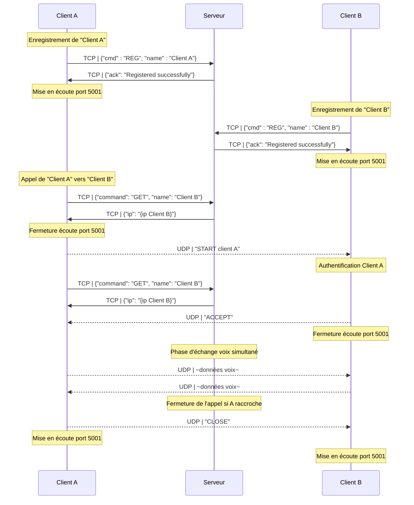

 

### Appel refusé

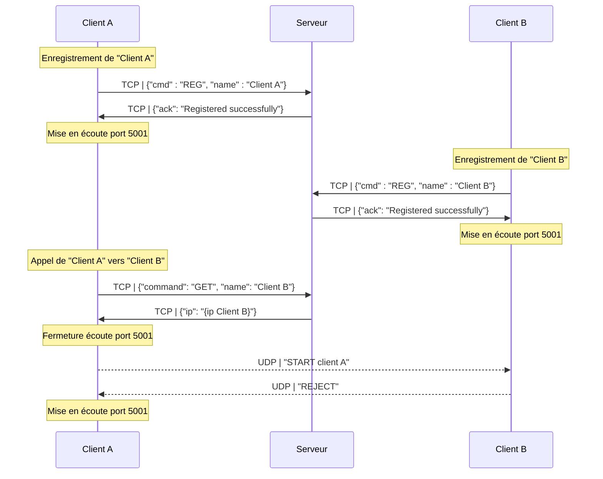

 

### Double Appel

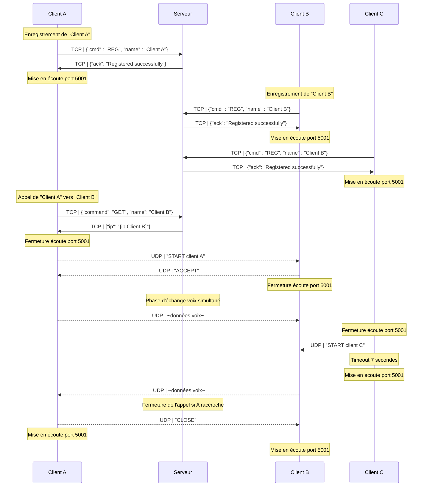

 

## Gestion de projet

### Gantt

Diagramme de Gantt :

||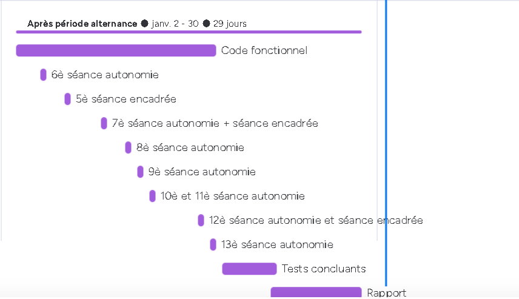|
|-|-|

### Répartition des tâches

Nous avons décidé de diviser le projet en 2 parties:

- Le "Front-end", qui correspond aux interfaces graphiques
- Le "Back-end", qui correspond aux gestions de la base de données, des flux réseaux, des threads etc...

De fait, chacun s'est retrouvé avec des missions claires :

- Mathys :

  - Design de l'IHM du serveur
  - Création de l'IHM du serveur
  - Accords avec Quentin concernant les fonctionnalités attendues de l'interface du serveur (logs, bouton de fermeture, affichage du socket d'écoute)
  - Interfaçage avec le back-end (relier les boutons aux fonctions)

- Damien :
  - Design de l'IHM du client
  - Création de l'IHM du client
  - Accords avec Quentin concernant les fonctionnalités attendues de l'interface du client (logs, bouton de configuration, connexion, appel, raccrochage, pop-up lorsqu'on reçoit un appel)
  - Interfaçage avec le back-end (relier les boutons aux fonctions)

- Quentin

  - Design du fonctionnement de l'application
    - Flux résaux (ports d'écoute et d'envoi)

  - Etablissement du protocole téléphonique (Cf. [Ici](#protocoles))
  - Gestion des threads
  - Gestion de la BDD
  - Gestion des sockets

### Communication

Pour ce projet, nous avons utilisé Discord avec des channels spécifiques(Front, Back, IHM-Back Serveur, IHM-Back Client).

Ainsi nous pouvions retrouver nos conversations facilement lorsqu'elles concernaient des points spécifiques.

Nous avions également un channel général pour planifier les séances d'autonomie et nos réunions.

### Gestion des risques

Pour éviter de perdre notre avancée, nous avons utilisé github pour héberger nos codes sources, gérer le versioning et collaborer plus facilement.

|Ce qu'on a bien réussi|Ce qu'on aurait pu améliorer|
|-|-|
|Les IHM sont modernes efficaces (logs, boutons simples)||
|Le protocole d'échange|La sécurité des échanges : on aurait pu inclure une fonction de chiffrement de la voix et un échange de clé secrète pour mieux gérer la confidentialité de l'appel|
Ce qu'on a bien réussi: Les interfaces sont designs, d'un côté le serveur met à jour la bed toute les secondes et on a les informations de connexion, ce qui est un avantage.
Ce qu'on aurait pu améliorer : On aurait pu gérer les différents cas de figure tel qu'un appel intervenant dans l'appel déjà existant entre deux clients par exemple. On aurait aussi pu gérer la sécurité car n'importe qui sur le réseau peut récupérer le flux TCP mais nous avons décidé d'aller au plus simple

 

## Fonctionnalités

Généralités :

Codes de sortie :

- 0 : Code complété correctement
- 1 : Avertissement (non critique)
- 2 : Erreur critique
- 3 : Erreur inconnue

Bibliothèques utilisées :

- pyaudio
- tkinter
- time
- json
- socket
- threading
- re (regex)

### Serveur

- Lancement d'une écoute sur le port 10000 et l'adresse qui permet de contacter le WAN (à défaut d'accès WAN, il faut hardcoder l'adresse)

<!-- omit from toc -->
#### Fonctionnalités de la base de données

- Enregistrement d'utilisateurs avec un nom d'utilisateur et une adresse IP
- Récupération de l'adresse IP d'un utilisateur en utilisant son nom d'utilisateur
- Suppression d'utilisateurs en utilisant leur nom d'utilisateur

<!-- omit from toc -->
#### Fonctionnalités du serveur

- Écoute de nouvelles connexions de clients
- Traitement des commandes reçues des clients (REG, GET, DISCONNECT)
- Envoi de réponses aux clients en fonction des commandes reçues
- Gestion des erreurs et des déconnexions de clients :
  - Si le client se déconnecte ou ferme la connexion TCP, suppression du client dans la BDD

<!-- omit from toc -->
#### Fonctionnalités de l'interface utilisateur

- Affichage du socket d'écoute
- Affichage des informations de journalisation pour suivre les activités du serveur
- Bouton pour fermer le serveur et quitter l'application.

<!-- omit from toc -->
#### Documentation fonctionnelle

<!-- omit from toc -->
##### init

Lors de l'initialisation de l'objet de cette classe , plusieurs champs et widgets sont créés et initialisés :

self.threads est une liste pour stocker les threads.
self.run_thread est un booléen pour déterminer si le thread doit s'exécuter.
self.master représente la fenêtre principale.
self.address et self.port sont respectivement l'adresse et le port d'écoute du serveur.
self.log_area est une zone de texte pour afficher les journaux.
self.db est une connexion à une base de données SQLite.
self.cursor est un curseur pour la base de données.
self.listener est un socket qui écoutera les connexions entrantes.
self.label est un label qui affichera l'adresse et le port d'écoute du serveur.
self.close_button est un bouton pour fermer le serveur.
self.db_frame est un cadre qui contiendra le contenu de la base de données.
self.db_tree est une vue d'arborescence qui affichera le contenu de la base de données.
self.db_scroll est une barre de défilement pour self.db_tree.
En outre, le code démarre un thread (thread) qui accepte les connexions entrantes et un autre thread (thread2) qui met à jour la vue d'arborescence de la base de données. Les widgets sont ensuite disposés dans la fenêtre principale.

<!-- omit from toc -->
##### update_db_tree

Cette fonction est une méthode qui permet de mettre à jour le contenu d'un widget "Treeview". Elle s'exécute en boucle tant que la variable "run_thread" est vraie.

La première étape est de vider le widget "Treeview" en supprimant tous les enfants (lignes) présents dans le widget.

Ensuite, la méthode exécute une requête SQL "SELECT * FROM users" pour récupérer le contenu de la table "users" dans la base de données.

Les lignes obtenues sont alors ajoutées au widget "Treeview", en utilisant la méthode "insert" et en spécifiant les valeurs (text, valeurs) pour chaque ligne.

Enfin, la méthode "sleep" fait une pause d'une seconde avant de relancer la mise à jour du widget "Treeview".

De fait, on peut avoir un affichage "live" (mis à jour chaque seconde) du contenu de la BDD du serveur.

<!-- omit from toc -->
##### accept_connection

Cette fonction "accept_connections" est une méthode qui permet d'accepter les connexions entrantes d'un client à un serveur. Elle s'exécute en boucle tant que la variable "run_thread" est vraie.

La méthode utilise la méthode "accept" sur l'objet "listener" pour accepter les connexions entrantes. Cela renvoie le couple (client, adresse) qui représente les informations sur le client connecté.

Pour chaque connexion client, une nouvelle thread (fil d’exécution) est créée en utilisant la méthode « Thread » de la bibliothèque « threading ». La méthode « handle_client » est spécifiée comme la cible (target) de ce thread et les arguments (client, adresse) sont passés en argument.

La nouvelle thread est ensuite démarrée en appelant la méthode « start » sur l’objet thread.

Enfin, le nouveau thread est ajouté à une liste « threads ».

Notez que la méthode inclut une clause « except » qui capture toutes les exceptions qui pourraient survenir lors de l’acceptation des connexions. Le passage sert à ignorer ces exceptions et à continuer la boucle.

<!-- omit from toc -->
##### delete_user

Cette fonction « delete_user » est une méthode qui permet de supprimer un utilisateur de la base de données.

La méthode prend en argument une chaîne de caractères « name » qui représente le nom d’utilisateur à supprimer.

Une instruction « print » est utilisée pour afficher le nom d’utilisateur passé en argument.

Ensuite, la méthode exécute une requête SQL « DELETE FROM users WHERE username= » {name}" ». Cette requête permet de supprimer l’enregistrement de l’utilisateur avec le nom d’utilisateur « name ».

La méthode « commit » sur l’objet « db » est appelée pour valider les modifications apportées à la base de données

<!-- omit from toc -->
##### handle_client

Cette fonction « handle_client » gère les demandes d’un client connecté à un serveur via un socket. Elle reçoit en entrée un socket (client) représentant la connexion avec le client et une adresse (address) représentant l’adresse IP et le port du client.

L’exécution de la fonction se fait dans une boucle qui s’arrête lorsque self.run _thread est faux. À chaque itération, la fonction reçoit les données envoyées par le client via client.recv (1024), décode les données et les analyse à l’aide de la méthode json. loads.

Le nom du client est ensuite stocké dans self.client_name à partir des données reçues.

Ensuite, la fonction analyse la commande dans les données reçues. Si la commande est « REG », la fonction appelle la méthode self.register_user (data ["name"], address [0]) pour enregistrer le client avec son nom et son adresse IP. En cas de réussite, un message de confirmation est envoyé au client et enregistré dans la zone de journalisation. Dans le cas contraire, un message d’erreur est envoyé au client et enregistré dans la zone de journalisation. Si une exception se produit lors de l’enregistrement, un message d’erreur est envoyé au client et enregistré dans la zone de journalisation.

Si la commande est « GET », la fonction appelle la méthode self.get _ip (data [« name »]) pour obtenir l’adresse IP associée au nom d’utilisateur donné. Si aucune adresse IP n’est trouvée, un message « inconnu du système » est envoyé au client et enregistré dans la zone de journalisation. Dans le cas contraire, l’adresse IP est envoyée au client.

Si la commande est « DISCONNECT », la fonction appelle la méthode self.delete_user (data [« name »]) pour supprimer l’utilisateur de la base de données.

Enfin, la réponse est envoyée au client en utilisant client.send (json. dumps (response) .encode ()).

En cas d’exception, la fonction essaie de supprimer l’utilisateur de la base de données et enregistre un message « disconnecté » dans la zone de journalisation.

La variable data [« command »] détermine la commande envoyée par le client. Si la commande est REG (enregistrement), la fonction appelle self.register_user pour enregistrer l’utilisateur avec son nom et son adresse IP. Le résultat de l’enregistrement est affiché dans la sortie standard et une réponse est envoyée au client.

Si la commande est GET (obtenir), la fonction appelle self.get _ip pour obtenir l’adresse IP associée au nom d’utilisateur. Si aucune adresse IP n’est trouvée, la réponse renvoyée au client est {"ip": "None"}.

Si la commande est DISCONNECT, la fonction appelle self.delete_user pour supprimer l’utilisateur de la base de données.

Enfin, la fonction envoie la réponse au client en utilisant client.send (json. dumps (response). encode ()).

<!-- omit from toc -->
##### register_user

La fonction register_user prend en entrée un nom d’utilisateur name et une adresse IP IP.
Elle effectue une requête SQL pour vérifier si un utilisateur avec le même nom existe déjà dans la base de données. Si un utilisateur avec ce nom existe déjà, la fonction renvoie False.
Si aucun utilisateur avec ce nom n’existe, la fonction insère un nouvel enregistrement dans la table users avec les valeurs fournies pour name et IP, puis renvoie True.
La méthode commit est ensuite appelée sur l’objet de base de données pour enregistrer les modifications dans la base de données.

<!-- omit from toc -->
##### get_ip

Cette fonction « get_ip » est une méthode qui est appelée pour récupérer l’adresse IP d’un utilisateur enregistré en utilisant leur nom d’utilisateur.
La première ligne utilise la méthode « execute » du curseur SQLite pour exécuter une requête SQL qui sélectionne toutes les entrées dans la table « users » où le champ « username » est égal à la valeur fournie pour le nom d’utilisateur « name ».
La deuxième ligne appelle la méthode « fetchone » du curseur pour obtenir le premier enregistrement correspondant à la requête précédente. Si aucun enregistrement n’est trouvé, la valeur renvoyée sera None.
La dernière ligne renvoie l’adresse IP de l’utilisateur trouvé, qui se trouve à la deuxième position (l’index 1) dans le tuple renvoyé par la requête SQL. Si aucun enregistrement n’a été trouvé, la valeur renvoyée sera None.

<!-- omit from toc -->
##### close

La fonction fait plusieurs choses :
Désactive les nouvelles connexions entrantes en changeant la valeur de la variable « run_thread » en False.
Si le socket du serveur est ouvert, il le ferme en appelant la méthode « close () ».
Ferme la connexion à la base de données en appelant la méthode « close () » sur l’objet « self.db ».
Ferme la fenêtre graphique principale en appelant la méthode « destroy () » sur l’objet « self. master ».
Termine le programme en appelant la fonction « sys.exit () ».

<!-- omit from toc -->
#### Illustrations

<!-- omit from toc -->
##### Connexion et déconnexion d’un utilisateur

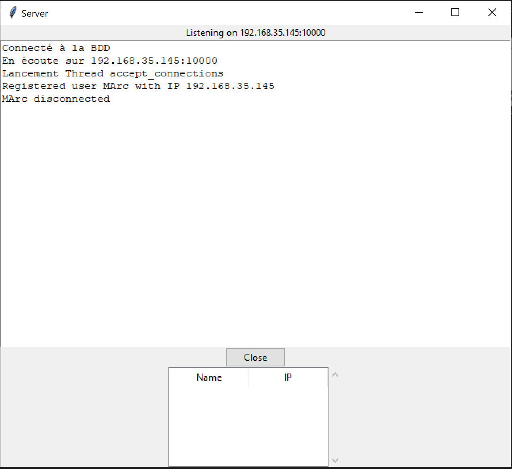

Ici on voit dans l’interface des logs que l’utilisateur s’est bien connecté puis déconnecté. Il a bien été supprimé de la BDD du serveur (affichage en dessous du bouton close en live).

<!-- omit from toc -->
##### Scénario normal

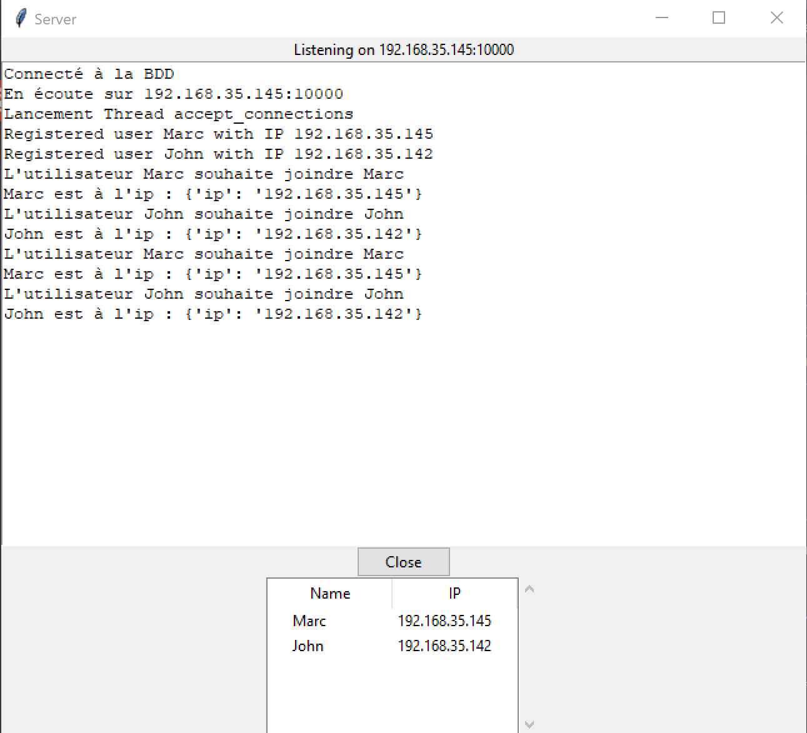

Ici, nous sommes dans le cas où John et Marc veulent s’appeler.
Nos deux utilisateurs se connectent au serveur qui joue le rôle d’annuaire.

### Client

– Pas de connaissance de sa propre IP, c’est le serveur qui enregistre l’IP avec laquelle il a été contacté (pas de support du NAT)

<!-- omit from toc -->
#### Connexion au serveur

– Le client peut se connecter à un serveur en saisissant l’adresse IP et le port dans la fenêtre de connexion.
– Le client peut envoyer son nom d’utilisateur au serveur lors de la connexion.
– Le client peut recevoir la liste des utilisateurs en ligne du serveur et l’afficher dans sa fenêtre.
– Le client peut se déconnecter du serveur en utilisant le bouton de déconnexion ou en fermant la fenêtre.

<!-- omit from toc -->
#### Appel en direct

– Le client peut envoyer une demande d’appel à un autre utilisateur en ligne en sélectionnant son nom dans la liste des utilisateurs et en appuyant sur le bouton « Appeler ».
– Le client peut recevoir une demande d’appel d’un autre utilisateur dans une fenêtre contextuelle, avec les options pour accepter ou rejeter l’appel.
– Le client peut accepter ou rejeter un appel en utilisant les boutons appropriés dans la fenêtre contextuelle d’appel entrant.
– Le client peut transmettre et recevoir de l’audio en direct avec un autre utilisateur lorsqu’un appel est accepté.
– Le client peut raccrocher à un appel en cours en utilisant le bouton « Raccrocher » ou en fermant la fenêtre.

<!-- omit from toc -->
#### Interface utilisateur

– Le client a une interface graphique avec une fenêtre de connexion, une fenêtre principale et une fenêtre contextuelle pour les appels entrants.
– Le client affiche des messages dans une zone de texte pour indiquer les actions en cours, comme la connexion au serveur, les demandes d’appel et les appels en cours.
– Le client utilise des boutons pour les actions telles que la connexion, l’appel, l’acceptation et le rejet des appels, et le raccrochage.

<!-- omit from toc -->
#### Utilisation de thread

– Le client utilise des threads pour écouter les demandes d’appel entrantes en arrière-plan, pour transmettre et recevoir de l’audio en direct lors d’un appel, et pour se déconnecter du serveur en arrière-plan

<!-- omit from toc -->
#### Documentation fonctionnelle

<!-- omit from toc -->
##### initialisation

Cette partie initialise l’interface graphique (GUI) et les sockets pour la connexion au serveur et la transmission audio.
Il définit des variables pour enregistrer des informations telles que l’IP du serveur, le port du serveur, le nom du client, l’état de la connexion, etc.
Ensuite, il crée deux sockets, un pour la connexion TCP avec le serveur et l’autre pour la transmission de l’audio UDP. Le socket UDP est lié à un port (5001).
Il initialise également des objets PyAudio pour l’enregistrement et la lecture audio et définit le format audio (paInt16), le nombre de canaux (1), la fréquence d’échantillonnage (8000 Hertz) et le nombre d’échantillons (512).
Enfin, il crée des éléments de l’interface graphique tels que des zones de saisie pour l’IP du serveur, le port du serveur et le nom du client, des boutons pour la configuration et l’appel, etc.

<!-- omit from toc -->
##### configure

La fonction est appelée pour configurer la connexion avec le serveur de communication à l’aide des informations saisies dans la GUI.
La fonction effectue les étapes suivantes :

 1. Récupère l’adresse IP du serveur, le numéro de port et le nom du client depuis les entrées de la GUI.

 2. Vérifie si l’adresse IP du serveur est valide en utilisant une expression régulière (regex).

 3. Vérifie si le numéro de port est un nombre compris entre 1024 et 65 535.

 4. Vérifie si un nom a été entré pour le client.

 5. Si les entrées sont valides, la fonction se connecte au serveur et envoie le nom du client pour l’enregistrer dans la base de données du serveur.

 6. Si la connexion et l’enregistrement réussissent, la fonction active un bouton pour lancer un appel et démarre un thread pour écouter les demandes d’appel entrantes.

 7. Si les entrées sont invalides, la fonction affiche un message d’erreur spécifiant la cause de l’échec.

<!-- omit from toc -->
##### call

Cette fonction initie un appel à un autre client. La méthode commence par vérifier si le nom du client à appeler n’est ni vide ni identique au nom du client appelant. Ensuite, il envoie une demande « GET » au serveur pour obtenir l’adresse IP du client à appeler. Si l’adresse IP du client appelé a été obtenue avec succès, il envoie une demande « START » au client appelé, contenant le nom de l’appelant. La réponse de l’appelé est ensuite attendue. Si la réponse débute par « ACCEPT », l’appel est considéré comme accepté et la transmission audio est démarrée. Si la réponse débute par « REJECT », l’appel est rejeté et le client revient en mode écoute.

<!-- omit from toc -->
##### listen_for_call_requests

Cette fonction écoute les demandes d’appel entrantes en utilisant un socket UDP sur le port 5001. Si une demande d’appel est reçue, elle ouvre une nouvelle fenêtre avec des boutons pour accepter ou refuser l’appel et attend que l’utilisateur accepte ou refuse l’appel. Si l’appel est accepté, elle envoie un message « ACCEPT » à l’appelant et commence la transmission de données audio. La fonction tourne en boucle tant que la variable « self.listening_for_calls » est vraie et s’exécute dans un thread séparé pour permettre une écoute en continu pour les demandes d’appel. Pour la fermer, il faut faire un thread.join () puis mettre la variable « self.listening_for_calls » à False.

<!-- omit from toc -->
##### accept_call

La fonction « accept_call » est utilisée pour accepter une demande d’appel entrant. Lorsque l’utilisateur clique sur le bouton d’acceptation dans la fenêtre d’appel entrant, cette fonction envoie un message « ACCEPT » au correspondant, ferme la fenêtre d’appel entrant et démarre la transmission de données audio dans un thread séparé. La fonction obtient d’abord l’adresse IP du correspondant en envoyant une demande « GET » au serveur avec le nom du correspondant. Si l’adresse IP est correctement récupérée, elle envoie 10 messages « ACCEPT » à l’adresse IP du correspondant et démarre la transmission audio. S’il y a une erreur dans la récupération de l’adresse IP, la fonction affiche un message d’erreur. On envoie 10 messages « ACCEPT », car nous avions des erreurs de non-réception du message par le destinataire, car il n’était pas encore prêt à recevoir la réponse du client.

<!-- omit from toc -->
##### reject_call

Cette fonction gère le rejet d’une demande d’appel entrante. Elle est appelée lorsque l’utilisateur clique sur le bouton « Decline » dans la fenêtre d’appel entrant ou lorsque la fenêtre d’appel entrant est fermée.
La fonction envoie un message « REJECT » à l’appelant en utilisant le socket serveur et en y associant un nom d’utilisateur. Elle reçoit une réponse du serveur contenant les informations de l’appelant, y compris son adresse IP. Si l’adresse IP est présente, elle envoie un message « REJECT » à l’appelant via son socket UDP. Enfin, la fonction démarre un nouveau thread d’écoute pour les demandes d’appel entrantes.

<!-- omit from toc -->
##### transmit_audio

La fonction « transmit_audio » est utilisée pour transmettre les données audio du flux d’entrée vers l’adresse IP du destinataire. Elle est appelée dans un thread séparé lorsqu’un appel est accepté. Elle lit en continu les données audio du flux d’entrée et les envoie à l’adresse IP du destinataire en utilisant le socket UDP. Elle écoute également les données audio entrantes sur le port 5001 et les joue via le flux de sortie.

<!-- omit from toc -->
##### raccrocher

La fonction raccrocher permet de terminer une connexion en cours avec un autre client. Elle vérifie si une connexion est en cours avec la variable call_in_progress, et si c’est le cas, elle exécute les actions suivantes :

– Arrête les flux audio d’entrée et de sortie (input_stream et output_stream)
– Envoie plusieurs messages « CLOSE » à l’autre client à l’aide du socket UDP
– Ajoute un message « Appel terminé » dans la fenêtre de log
– Désactive le bouton « Raccrocher »
– Lance un nouveau thread pour écouter les demandes d’appel entrantes.

<!-- omit from toc -->
##### close

La fonction « close » est une fonction pour fermer la fenêtre de l’interface graphique du client. La fonction « close » commence par appeler la fonction « raccrocher » pour terminer toute communication en cours. Si le client est connecté au serveur, une requête de déconnexion est envoyée au serveur en utilisant un socket UDP. Le socket est ensuite fermé. Enfin, un message de déconnexion du serveur est inséré dans le journal et la fenêtre de l’interface graphique est détruite.

<!-- omit from toc -->
#### Illustrations

<!-- omit from toc -->
##### Configuration initiale

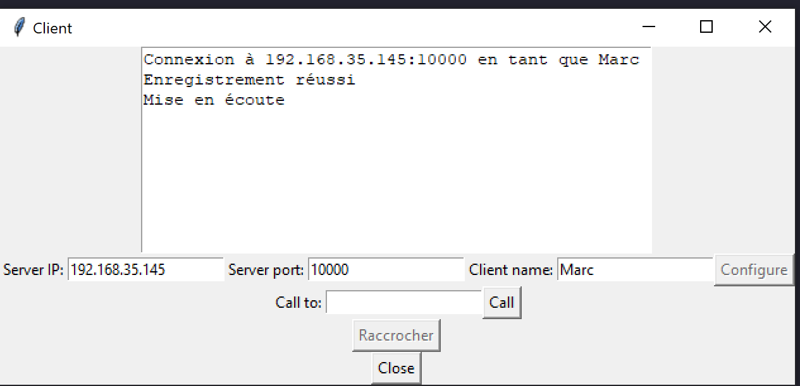

 Au lancement du client, il y a création de différents éléments de l’interface graphique tels que des champs de saisie pour l’adresse IP du serveur, le port du serveur, le nom du client, des boutons pour configurer et appeler, et un champ de texte pour afficher les informations de log. Il définit également les comportements pour ces éléments, comme les fonctions à appeler lorsque les boutons sont cliqués. L’adresse IP du Serveur et le port sont prérentrés.
On a juste a ajouter notre nom (ici Marc) et cliquer sur configurer (ou la touche « entrée ») pour s’enregistrer au sein de la bdd du serveur.

<!-- omit from toc -->
##### Erreur pas de nom

Si on n’inscrit pas de nom lors de la configuration initiale, alors la connexion au serveur est impossible et un message d’erreur est généré dans la fenêtre de log (« Vous devez entrer un nom »)

<!-- omit from toc -->
###### Destinataire inconnu

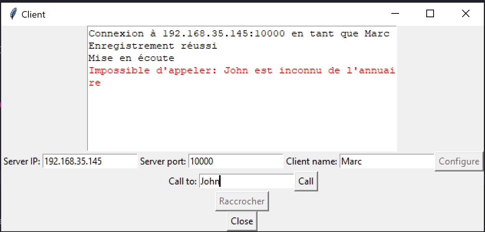

Si le destinataire que l’on souhaite joindre est indisponible, alors on reçoit un message du serveur nous annonçant la situation et le client nous affiche une alerte.

<!-- omit from toc -->
##### Timeout

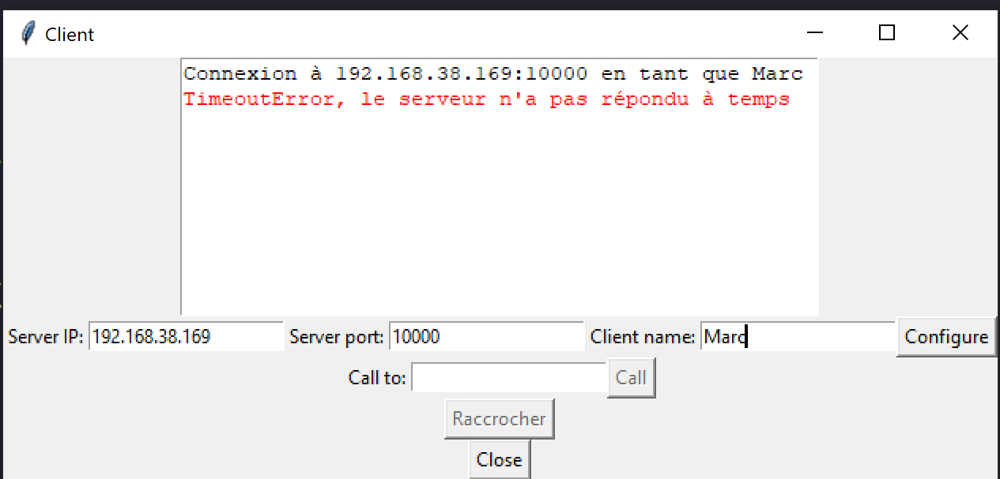

Si lors de la connexion, l’adresse entrée est correcte, mais n’est pas joignable, alors on indique qu’il y a une erreur de connexion à l’utilisateur (au bout de 1 s, délai raisonnable pour une connexion réseau).

<!-- omit from toc -->
##### IP invalide

Si le format de l’adresse IP n’est pas le bon alors la connexion au serveur est impossible et un message d’erreur est généré dans la fenêtre de log (« L’adresse IP est invalide »).
On a réussi à obtenir ça grâce à une expression régulière (REgex) qui filtre les IP possibles.

<!-- omit from toc -->
##### Port invalide

Si on modifie le port déjà prérentré et qu’il n’est pas compris entre 1024 et 65 535 alors la connexion au serveur est impossible et un message d’erreur est généré dans la fenêtre de log (« Le numéro de port doit être compris entre 1024 et 65 535 »).

<!-- omit from toc -->
##### Plusieurs appels d’affilée

Lorsqu’un client envoie une demande d’appel, le serveur reçoit sa requête de demande d’IP. Il sait alors qu’un appel va bientôt être passé. Il sait qu’un appel a été accepté s’il reçoit une demande d’IP de celui qui a été appelé au nom de celui qui appelle (authentification de l’IP).

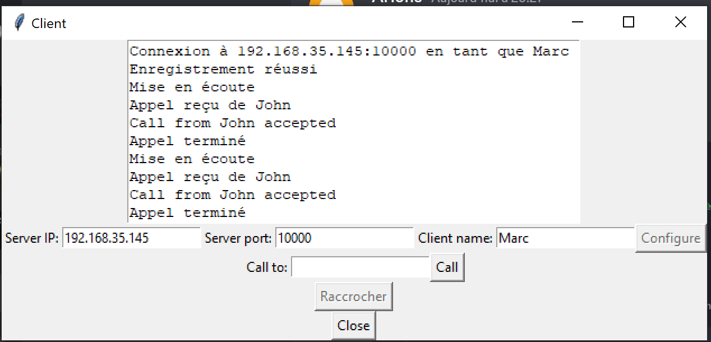

Côté client, tout se passe normalement lorsqu’un appel est passé, on peut raccrocher et relancer un appel correctement.

<!-- omit from toc -->
##### Pop-Up appel reçu

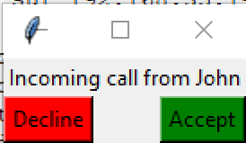

Voici la pop-up reçue. Si un appel est accepté alors on clique sur accepter puis elle se ferme.

Au contraire, si on rejette l’appel ou qu’on attend trop longtemps, elle se ferme et ne donne pas suite à l’appel.
Du côté de l’appelant, si le délai a expiré (7 s), alors on considère que l’appel ne passera pas et on se remet en écoute, l’utilisateur peut passer un nouvel appel.

 

<!-- omit from toc -->
## Évolutions possibles

– Ajout d’une fonctionnalité de chat en direct pendant un appel : Il serait possible d’ajouter une fonctionnalité de chat en direct pendant un appel, qui permettrait aux utilisateurs de communiquer par écrit en plus de parler.

– Ajout d’une fonctionnalité de partage d’écran : Il serait possible d’ajouter une fonctionnalité de partage d’écran pour permettre aux utilisateurs de partager leur écran avec les autres utilisateurs en cours d’appel.

– Support de plusieurs utilisateurs en appel simultanément : Il serait possible d’ajouter une fonctionnalité de conférence téléphonique pour permettre à plusieurs utilisateurs de participer à un appel simultanément.

– Ajout de fonctionnalités de sécurité : Il serait possible d’ajouter des fonctionnalités de sécurité pour protéger les communications, comme le chiffrement de bout en bout pour garantir la confidentialité des conversations.

– Ajout de fonctionnalités de personnalisation : Il serait possible d’ajouter des fonctionnalités de personnalisation pour permettre aux utilisateurs de personnaliser l’apparence de l’application, comme changer les couleurs, les polices, etc.

 

## Bilans

### Quentin

De mon côté, j'ai trouvé ce projet enrichissant, il vient bien compléter ce qu'on a vu en cours via la conception de protocole téléphonique et la gestion de projet avec l'alternance en groupe.
On a eu beaucoup de difficultés tout de même au début, on était un peu perdus et on ne savait pas vraiment où aller, comment ça allait se passer etc. Au final, je trouve qu'on a bien réussi le projet, même s'il y avait beaucoup de points que l'on pouvait améliorer.
Je trouve que pour notre niveau en programmation, avec un peu d'accompagnement sur la conception, les fonctionnalités attendues, et les libertés que l'on peut s'accorder, le projet aurait pu être mieux effectué.

### Mathys

Ce projet m’a apporté beaucoup. En effet j’ai pu développer des connaissances dans le domaine de la programmation et appliquer ce que j’ai appris sur un projet concret. D’un autre côté j’ai trouvé intéressant la gestion de projet, la création d’un gantt et la gestion des risques. De plus, ce projet c’est effectué en trinôme, ce qui a renforcé le travail d’équipe et la cohésion entre nous.

### Damien

Ce projet était vraiment intéressant pour moi. Il a rassemblé pleins de domaines : la programmation , le réseau ,  la communication et la gestion de projet. J'ai trouvé le projet enrichissant que ce sois pour notre formation mais également pour mon alternance.Ce projet à bien fonctionné grâce a un groupe bien organisé et travailleur.

<!-- omit from toc -->
### Bilan Général

Globalement, nous avons trouvé que ce projet était intéressant. Tant à la conception du protocole d’échange qu’à la conception des interfaces et la gestion des erreurs (fréquente tant elles peuvent venir de n’importe où (voix, IHM ou réseau)). Toutefois, nous aurions apprécié avoir plus de guidance au début de ce projet pour mieux cerner ce que l’on devait faire et non simplement « une application de VoIP ». À savoir : si l’application devait être peer-to-peer ou centralisée, si on devait respecter un protocole spécifique (SIP) ou en créer un, une convention sur les ports, etc. Nous avons pu répondre à ces questions grâce à l’enseignant au milieu du projet, mais nous aurions préféré pouvoir balayer celles-ci dès le départ. Nous aurions pu gagner quelques semaines de travail au lieu de chercher à avoir les réponses auprès de l’enseignant.
Une autre difficulté était de gérer le temps. En effet, avec l’alternance, les cours à l’IUT sont tous condensés et nous n’avons pas beaucoup de temps après les cours pour travailler en profondeur sur tous les projets.

Nous conservons pour ce projet une appréciation positive.

Quentin Noilou  
Damien Rocabois  
Mathys Person
